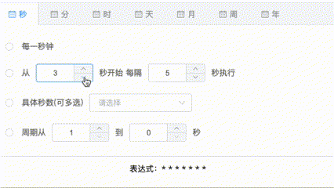

# Vue-Crontab

Vue-Crontab is a configurable generator of crontab expressions

## Preview


## Fearture
* customer config tabs
* responsive data
* international language

## Dependency
* Vue @2.x
* ElementUI @2.x
* TypeScript
* vue-property-decorator

<br>

# Getter Started
## Installation
you can install VueCrontab using the following commands:

NPM: 
```
npm install vue-crontab-generator
```

Yarn:
```
yarn add vue-crontab-generator
```

## Example

```html
<template>
  <vue-crontable v-model="cron" :i18n="cn" periods="{s} {m} {h} {d} {M} {W} {Y}" />
</template>

<script lang="ts">
import { Vue, Component } from 'vue-property-decorator'
import VueCrontab from 'vue-crontab-generator'

@Component({
  components: {
    VueCrontab
  }
})

export default class Example extends Vue {
  cron: string = '* * * * * ? *'
}
</script>
```

## Params
| property | value | default value |
| :----| :---- | :---- |
| value | v-model binding value | "" |
| i18n | International language, currently only support Chinese and English，"en" | "cn" | "cn" |
| periods | Expression format rules, according to the default value to add or delete configuration | "{s} {m} {h} {d} {M} {W} {Y}" |
| showText | Show bottom crontab expression | true |
| selectPopperClass | el-select popper-class property | "" |
| disabled | readonly parameter | false |

## method
| name | description | params |
| :---- | :---- | :---- |
| change | Triggered when the expression changes | val: Current expression value |

## Tips
* periods: Must be in accordance with the order configuration, based on the default format to add or delete
* selectPopperClass: It can fixed el-select obscured problem due to z-index too low